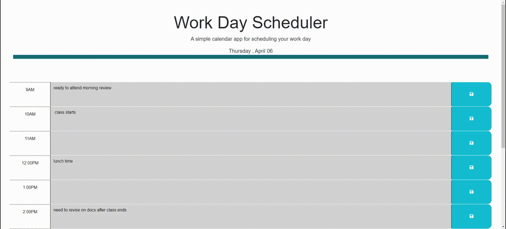

# Third-Party APIs: Work Day Scheduler


## Description

[Visit the Deployed Site](https://aarticontractor.github.io/work-day-scheduler/)
<br>
The Work Day Planner creates efficency and ease among your busy schedule. You can document all upcoming events for the day in your planer, It's easy to keep track with the color boxes; grey indicates the past, red indicaates the current time, and green indicates the promising future, making it visually easy for varying consumers to keep track of the their time and events.
<br>
<br>
<br>
<br>

## Technology Used 

| Technology Used         | Resource URL           | 
| ------------- |:-------------:| 
| HTML    | [https://developer.mozilla.org/en-US/docs/Web/HTML](https://developer.mozilla.org/en-US/docs/Web/HTML) | 
| CSS     | [https://developer.mozilla.org/en-US/docs/Web/CSS](https://developer.mozilla.org/en-US/docs/Web/CSS)      |   
| Git | [https://git-scm.com/](https://git-scm.com/)     |  
| JavaScript | [https://developer.mozilla.org/en-US/docs/Web/JavaScript](https://developer.mozilla.org/en-US/docs/Web/JavaScript) |  
| Web API | [https://developer.mozilla.org/en-US/docs/Web/API](https://developer.mozilla.org/en-US/docs/Web/API)  |
|DayJs| [https://day.js.org/](https://day.js.org/) |

<br>


## Table of Contents

* [Application Highlights and Usage](#application-highlights-and-usage)
* [Code Snippets](#code-snippets)
* [Learning Points](#learning-points)
* [Author Info](#author-info)
* [Credits](#credits)

<br>


## Application Highlights and Usage
<br>

The following animation demonstrates the application functionality where when the user clicks the save button for that timeblock then the text for that event is saved in local storage and upon refreshing the saved events persists:


<br>
<br>



<br>
<br>
<br>

## Code Snippets

<br>

The following code snippet shows how each timeblock is color coded to indicate whether it is in the past, present, or future depending on the current hour

```javascript

function hourlyColor() {
    
$('.time-block').each(function() {
const blockHour = parseInt(this.id.substring(5));
      
      $(this).toggleClass('past', blockHour < currentHour);
      $(this).toggleClass('present', blockHour == currentHour);
      $(this).toggleClass('future', blockHour > currentHour);
    });
  }

  hourlyColor();
```

<br>
<br>
<br>

The below snippet shows the function where the user inputs are stored in the local storage after clicking on the save button:

```javascript

function saveTasks() {
    $('.saveBtn').on('click', function() {
      const idName = $(this).parent().attr('id');
      const textAreaValue = $(this).siblings('.description').val();
      localStorage.setItem(idName, textAreaValue);
    });
  }
  saveTasks();


function loadTasks() {
    $('.saveBtn').each(function() {
      const idName = $(this).parent().attr('id');
      const textAreaValue = localStorage.getItem(idName)
      $(this).siblings('.description').text(textAreaValue);
    });
  }
  loadTasks();
```

<br>
<br>
<br>

## Learning Points 

   I learned the following skills while doing this project:
<br>
- Java script basics (functions, arrays, for-loops, if-else, alerts, prompts, confirm, etc)
- How to use the DAYJS library for date and time 
- When to use the 'this' variable
- How to use $ attribute instead of .addeventListener using JQUERY to capture data from an HTML element
- How to store values in the local storage of the web browser
- JQUERY UI, widgets and interactions with the HTML


<br>

## Author Info

### Aarti Contractor


- Portfolio: https://aarticontractor.github.io/aarticontractor_portfolio/
- Linkedin: https://www.linkedin.com/in/aarti-contractor/
- Github: https://github.com/aarticontractor

<br>

## Credits

- https://jqueryui.com/
- https://developer.mozilla.org/en-US/docs/Web/JavaScript
- https://beautifier.io/
- https://onecompiler.com/javascript/3z45t4b2m
- https://cloudconvert.com/webm-to-gif
- https://developer.mozilla.org/en-US/docs/Web/API
- https://day.js.org/


<br>

© 2023 edX Boot Camps LLC. Confidential and Proprietary. All Rights Reserved.

